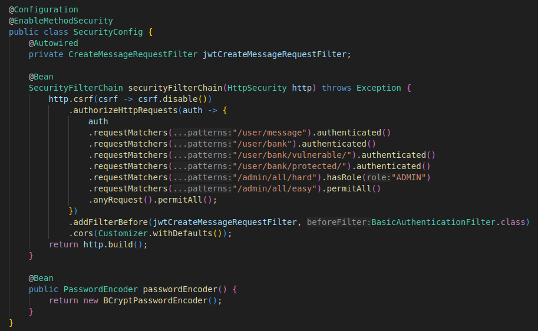
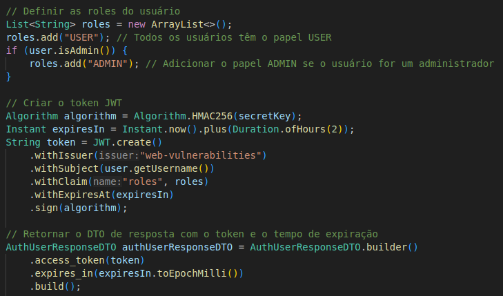
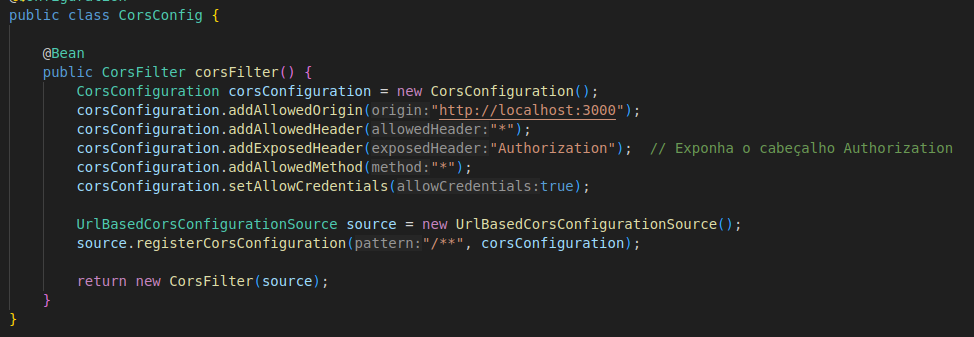
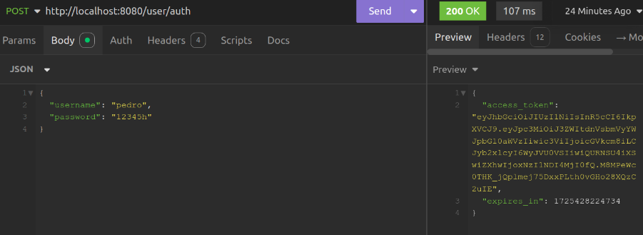
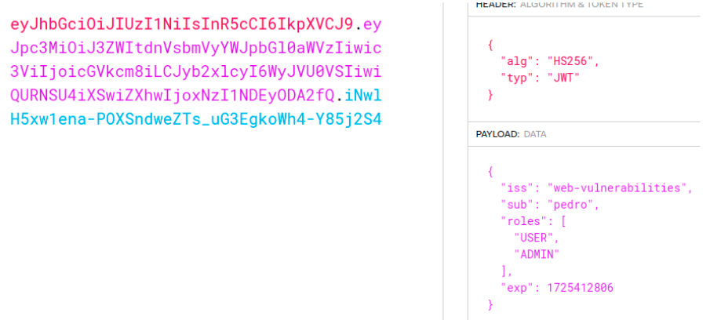
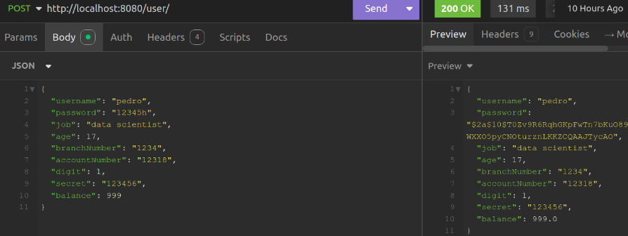
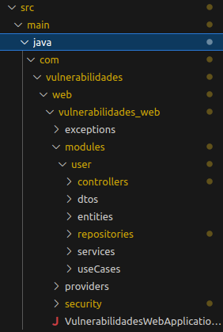
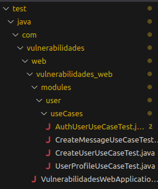
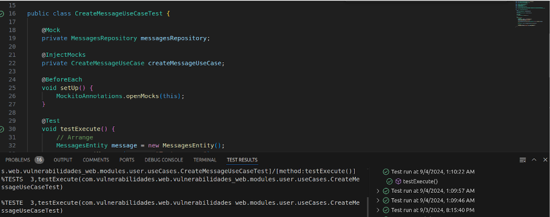

## Uso dos frameworks CSS Bootstrap e Tailwind 

--

## Uso de Configurações de segurança

Foi utilizado configurações de Segurança como autenticação por meio de token de acesso

Tal token possui algumas informações armazenadas, como:

* username
* cargos: *USER* e *ADMIN*

Para fazer o token de acesso, foi utilizado o JWT

Esse token nos permite permitir o acesso do usuário a certas páginas dependendo de seu cargo

### Criptografia de senha:

## Foi seguido padrões de arquitetura para fazer o código do Backend

## Realizado Testes Unitários no Backend e no Frontend

**Não é atividade complementar**

